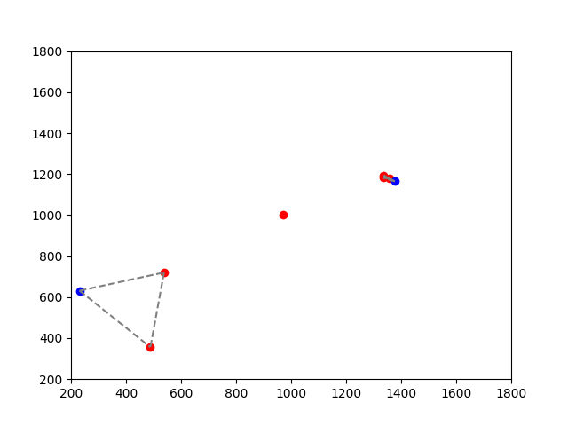

# SDD Graph Utilities

Some utilities for extracting graph data from the [Stanford Drone Dateset](http://cvgl.stanford.edu/projects/uav_data/)

## Dependencies

- python3
- numpy
- matplotlib
- csv

## Usage

Currently, the script `parser.py` extracts data from a annotation file
of the SDD and plays an animation of an associated graph over time:

e.g.
`./parser.py ./SDD/quad/video0/annotations.txt`

Gives rise to a visualization like this:

where bikes are shown in blue, pedestrians are red, and nodes are connected if they are
closer than a given threshold. 

